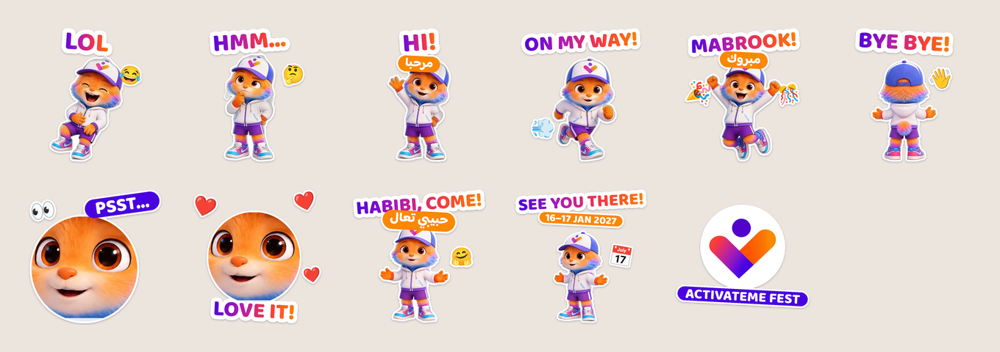

# Acti sticker pack

WhatsApp stickers of **Acti**, the ActivateMe Fest mascot: 11 stickers, each with its own pose, with English captions and some in Arabic too. More are on the way, see `poses/PROMPTS.md`.



| File | What it is |
|---|---|
| `stickers/whatsapp/*.webp` | The stickers in WhatsApp format: 512×512, transparent, each under 100 KB |
| `stickers/whatsapp/tray.png` | 96×96 pack icon |
| `stickers/whatsapp/contents.json` | Pack details in the format WhatsApp's official sticker code expects |
| `stickers/png/*.png` | The same stickers as PNG, for Telegram, iMessage, Instagram stories, print |

## Getting them into WhatsApp

WhatsApp only lets apps add sticker packs, so there are three routes:

1. **From the ActivateMe app (best).** Add an "Add Acti stickers to WhatsApp" button. WhatsApp publishes free code for this for both iOS and Android (github.com/WhatsApp/stickers). The `stickers/whatsapp` folder is already in the format it expects: drop it in as the pack's assets and fill in the app's store links in `contents.json`. It also gives people another reason to download the app.
2. **Quick, no developers needed.** Upload the PNGs to the free **Sticker.ly** app, publish the pack, and share its link. Anyone who taps the link gets an "Add to WhatsApp" button.
3. **For the team right now.** Send the stickers into a chat, then long-press each one and choose **Add to Favourites**.

## Changing or adding stickers

Captions, emojis and layouts are all in `tools/make_stickers.py`. Edit them and run:

```bash
pip install pillow numpy scipy   # Pillow needs libraqm for the Arabic captions
python3 tools/make_stickers.py
```

This rebuilds every sticker, the tray icon, `contents.json` and `preview.png`. WhatsApp allows up to 30 stickers per pack.

## New poses

New Acti poses are generated with an image AI tool, using the prompts in `poses/PROMPTS.md`. To add or upgrade a pose:

1. Save the full-size image in `poses/` with the pose's name, e.g. `poses/lol.png`.
2. Run `python3 tools/cut_poses.py` to cut out the background (needs `pip install rembg onnxruntime`).
3. Run `python3 tools/make_stickers.py`.

The five new poses (`lol`, `hmm`, `wave`, `run`, `jump`) are currently built from small Canva previews in `poses/preview/`, so they look slightly soft up close. Drop the full-size downloads into `poses/` and rerun both scripts to sharpen them.

`source/` holds the Acti cut-outs: the character sheet poses and the generated `pose_*.png` files. Fonts are Baloo 2 and Baloo Bhaijaan 2 (Arabic), both under the SIL Open Font License (`fonts/OFL.txt`).
