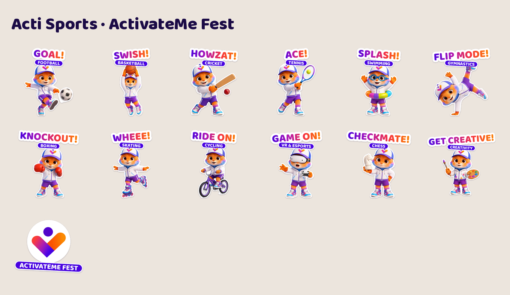

# Acti sticker packs

WhatsApp stickers of **Acti**, the ActivateMe Fest mascot. There are two packs, and every sticker has its own pose:

- **Acti** (18 stickers): everyday reactions such as LOL, HMM…, HI!, MABROOK!, SHUKRAN!, OMG!, NOOO!, HABIBI COME!, YALLA!, with Arabic on several.
- **Acti Sports** (13 stickers): one sticker for each festival activity: GOAL!, SWISH!, HOWZAT!, ACE!, SPLASH!, FLIP MODE!, KNOCKOUT!, WHEEE!, RIDE ON!, GAME ON!, CHECKMATE!, GET CREATIVE!

| File | What it is |
|---|---|
| `stickers/whatsapp/<pack>/*.webp` | The stickers in WhatsApp format: 512×512, transparent, each under 100 KB |
| `stickers/whatsapp/<pack>/tray.png` | 96×96 pack icon |
| `stickers/whatsapp/contents.json` | Both packs, in the format WhatsApp's official sticker code expects |
| `stickers/png/<pack>/*.png` | The same stickers as PNG, for Telegram, iMessage, Instagram stories and print |

## Getting them into WhatsApp

WhatsApp only lets apps add sticker packs, so there are three routes:

1. **From the ActivateMe app (best).** Add "Add Acti stickers to WhatsApp" buttons using WhatsApp's free sample code for iOS and Android (github.com/WhatsApp/stickers). `stickers/whatsapp` is already in the format it expects: one folder per pack plus `contents.json`. Fill in the app's store links in `contents.json`.
2. **Quick, no developers needed.** Upload the PNGs to the free **Sticker.ly** app, publish each pack, and share the links.
3. **For the team right now.** Send the stickers into a chat, then long-press each one and choose **Add to Favourites**.

## How it's made

1. **Poses** are generated in Canva from the Acti reference. `poses/PROMPTS.md` has the prompts, and `poses/CANVA_IDS.md` lists every image's Canva ID. They're also collected in the Canva design "Acti poses".
2. `poses/canva600/` holds a 600 px copy of each pose. For even sharper results, put full-size Canva downloads in `poses/` with the same names (e.g. `poses/laugh.png`); they're used automatically.
3. `python3 tools/cut_poses.py` cuts out the backgrounds into `source/pose_*.png` (needs `pip install rembg onnxruntime`).
4. `python3 tools/make_stickers.py` builds both packs, the tray icons, `contents.json` and the previews (needs `pip install pillow numpy scipy`, with Pillow built with libraqm for Arabic).

Captions, emojis and layouts live in `build_main()` and `build_sports()` in `tools/make_stickers.py`. WhatsApp allows 3–30 stickers per pack.

`source/` also holds the original character-sheet cut-outs (front, back, three-quarter, side and face). Fonts are Baloo 2 and Baloo Bhaijaan 2 (Arabic), under the SIL Open Font License (`fonts/OFL.txt`).
